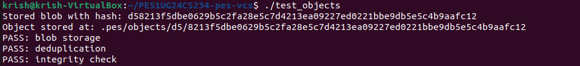
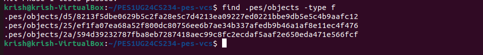
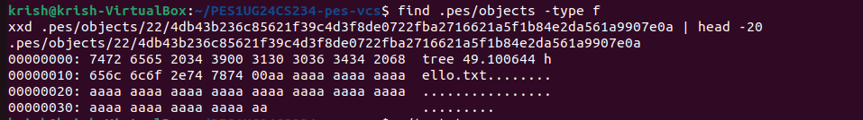
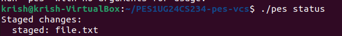
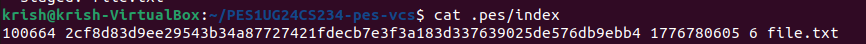
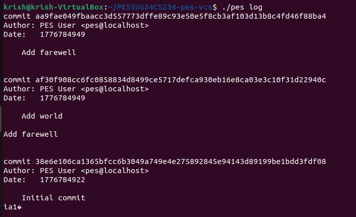
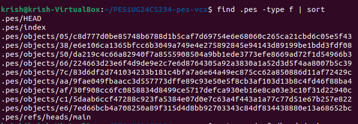
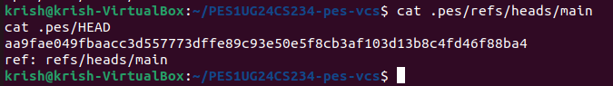
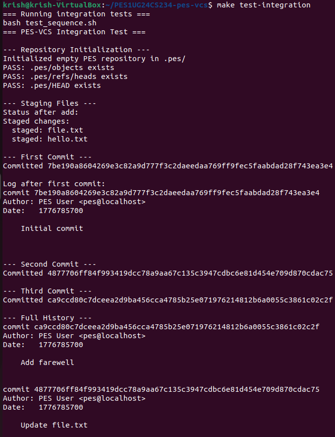
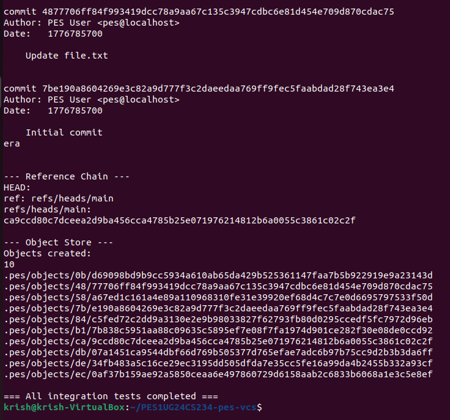

# PES-VCS Lab Report

Name: Krish Yadav  
SRN: PES1UG24CS234  

---

# PES Version Control System

## Phase 1

### Screenshot 1A

### Screenshot 1B

---

## Phase 2

### Screenshot 2A

### Screenshot 2B

---

## Phase 3

### Screenshot 3A

### Screenshot 3B

---

## Phase 4

### Screenshot 4A

### Screenshot 4B

### Screenshot 4C

---

## Integration Test

### Screenshot

---

# Phase 5 Answers

## Q5.1 – Branch Checkout

To implement `pes checkout <branch>`, the system would:

1. Update `.pes/HEAD` to point to the new branch reference.
2. Read the commit hash stored in `.pes/refs/heads/<branch>`.
3. Load the commit object and retrieve its tree.
4. Reconstruct the working directory from the tree objects.

The complexity comes from updating the working directory safely. Files must be replaced or deleted to match the target branch snapshot.

---

## Q5.2 – Detect Dirty Working Directory

Before switching branches, the system must detect uncommitted changes.

Steps:

1. Compare the working directory files with the index.
2. If file modification time or size differs from the index entry, recompute the hash.
3. If the computed hash differs from the staged hash, the file has uncommitted changes.

If such files exist and the target branch modifies them, checkout must refuse.

---

## Q5.3 – Detached HEAD

Detached HEAD occurs when `.pes/HEAD` stores a commit hash directly instead of a branch reference.

In this state:

- New commits are created normally.
- However, no branch reference points to them.

These commits can be recovered by creating a branch pointing to the commit:

# Phase 6 Answers

## Q6.1 – Garbage Collection

To reclaim unused objects:

1. Start from all branch references in `.pes/refs/heads`.
2. Traverse the commit graph recursively.
3. From each commit, follow the tree pointer.
4. From trees, follow all blob and subtree references.

All visited objects are marked as reachable.

After traversal, any object not marked reachable is deleted.

A hash set can be used to store reachable object hashes efficiently.

In a repository with 100,000 commits and 50 branches, the traversal would visit all reachable commits and their trees and blobs.

---

## Q6.2 – Race Condition During GC

Garbage collection running concurrently with a commit operation can cause a race condition.

Example:

1. Commit process writes a blob object.
2. GC scans reachable objects and does not yet see the new commit referencing that blob.
3. GC deletes the blob as unreachable.
4. Commit finishes and references a blob that no longer exists.

Git avoids this by:

- Using lock files
- Running GC only when repository is idle
- Using packfiles and mark-and-sweep algorithms
- Protecting newly created objects during operations
